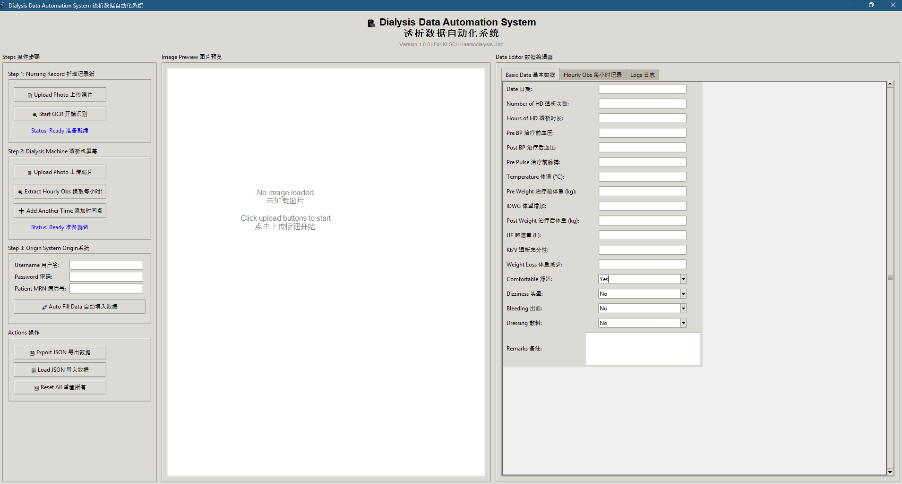

# 🏥 Dialysis Data Automation System | 透析数据自动化系统

<div align="center">



🌍 English | 中文

Automated OCR and data entry solution for hemodialysis treatment records  
透析治疗记录的自动 OCR 识别与数据录入自动化解决方案

</div>

---

<details open>
<summary><b>📖 English Documentation</b></summary>

## 📋 Table of Contents
- [🎯 Overview](#-overview)
- [✨ Key Features](#-key-features)
- [🎬 Demo](#-demo)
- [💻 System Requirements](#-system-requirements)
- [🚀 Quick Start](#-quick-start)
- [📖 User Guide](#-user-guide)
- [📁 Project Structure](#-project-structure)
- [⚙️ Configuration](#️-configuration)
- [❓ FAQ](#-faq)
- [🗺️ Roadmap](#️-roadmap)
- [🤝 Contributing](#-contributing)
- [📜 License](#-license)
- [👨‍💻 Author](#-author)

---

## 🎯 Overview
An automated data entry system for hemodialysis units.  
Uses **OCR (Optical Character Recognition)** to extract data from nursing records and dialysis machine screens, automatically filling them into the hospital's **Origin System**, reducing manual workload.

### Background & Motivation
👩‍⚕️ Nurses manually enter large volumes of dialysis data daily  
📄 Data from paper records and machine screens  
⏰ Time-consuming, error-prone, repetitive  
💡 Solution: OCR recognition + automation  

### Why This Project?
As a nurse learning programming, I created this tool to:
- 🎯 Solve real healthcare problems  
- 🚀 Reduce colleagues’ workload  
- 💻 Apply programming to nursing practice  
- 🌟 Bridge technology and healthcare  

---

## ✨ Key Features

### 📸 OCR Recognition
✅ Nursing Record Recognition – Extracts date, BP, weight, dialysis parameters  
✅ Machine Screen Recognition – Extracts hourly data (BP, VP, QB, QD, Pulse, UFR)  
✅ High Accuracy – Powered by EasyOCR  
✅ Smart Fault Tolerance – Flexible formats supported  

### 🤖 Automated Data Entry
✅ Origin System Auto-login  
✅ Auto-navigation to record page  
✅ MRN-based patient search  
✅ Auto-fill & save  

### 💾 Data Management
✅ Import/Export JSON  
✅ Validation & manual correction  
✅ Operation logging  

### 🌐 User Interface
✅ Bilingual (English + 中文)  
✅ Intuitive 3-step workflow  
✅ Real-time image preview  
✅ Live logging  

---

## 🎬 Demo

┌─────────────────────────────────────────────────────────┐
│ 🏥 Dialysis Data Automation System │
│ Version 1.0.0 | For KLSCH Haemodialysis Unit │
├─────────────────────────────────────────────────────────┤
│ Steps │ Image Preview │ Data Editor │
│ Step 1: Upload Photo │ [Preview] │ Basic Data │
│ Step 2: Extract Obs │ │ Hourly Obs │
│ Step 3: Auto Fill │ │ Complete! │
└─────────────────────────────────────────────────────────┘

**Workflow:**  
📷 Photo → 🔍 OCR → ✏️ Verify → 🤖 Auto-fill → ✅ Done

---

## 💻 System Requirements

**Required**
- Python 3.8+  
- Windows 10/11 (Recommended) or Linux/Mac  
- 4GB RAM, 500MB Disk  
- Chrome Browser  

**Network**
- Access to hospital Origin system  
- Internet (for OCR model download)

---

## 🚀 Quick Start

### Method 1: One-Click Launch
```bash
git clone https://github.com/USAGI7878/dialysis-automation.git
cd dialysis-automation
start.bat
✅ Creates virtual env → Installs deps → Launches app

Method 2: Manual Installation
bash
Copy code
git clone https://github.com/USAGI7878/dialysis-automation.git
cd dialysis-automation
python -m venv venv
venv\Scripts\activate  # Windows
pip install -r requirements.txt
python main.py
📖 User Guide
Workflow
1️⃣ Upload nursing record → OCR
2️⃣ Verify/correct data
3️⃣ Upload machine screen → OCR hourly obs
4️⃣ Enter Origin credentials + MRN
5️⃣ Click “Auto Fill Data” → ✅ Done!

📁 Project Structure
pgsql
Copy code
dialysis-automation/
├── main.py
├── config.json
├── requirements.txt
├── start.bat
├── modules/
│   ├── ocr_module.py
│   ├── origin_automation.py
│   └── data_processor.py
├── data/
│   ├── exports/
│   └── temp/
├── logs/
│   └── automation.log
└── docs/
    └── screenshots/
⚙️ Configuration
json
Copy code
{
  "origin_url": "http://192.168.20.11:8080/EMR/main.jsp",
  "ocr_settings": {
    "use_gpu": false,
    "confidence_threshold": 0.5
  },
  "selenium_settings": {
    "headless": false,
    "implicit_wait": 10
  }
}
❓ FAQ
Q1: OCR not accurate?
✅ Use clear, well-lit photos
✅ Avoid glare, shadows
✅ Manually correct in “Data Editor”

Q2: Automation failed?
✅ Check network
✅ Verify credentials & MRN
✅ Check logs/automation.log

Q3: Use at home?
✅ OCR & data edit work offline
❌ Auto-fill requires hospital network

🗺️ Roadmap
✅ v1.0.0 – OCR, automation, bilingual UI
🚧 v1.1.0 – Accuracy, batch processing, reports
📅 v2.0.0 – Cloud sync, mobile app, AI validation

🤝 Contributing
Fork the repo

Create a branch

Commit & push

Submit a PR

📜 License
Licensed under the MIT License – see LICENSE file.

👨‍💻 Author
@USAGI7878 – Healthcare IT Nurse
📧 peggy8526123@gmail.com

<div align="center"> ⭐ If this project helps you, please give it a Star! Made with ❤️ by a nurse who codes. </div> </details>
<details> <summary><b>📖 中文文档</b></summary>
📋 目录
🎯 项目简介

✨ 核心功能

🎬 演示

💻 系统要求

🚀 快速开始

📖 使用指南

📁 项目结构

⚙️ 配置说明

❓ 常见问题

🗺️ 开发路线图

🤝 贡献指南

📜 许可证

👨‍💻 作者

🎯 项目简介
本系统为血液透析单位设计，利用 OCR 技术自动识别护理记录与透析机屏幕信息，自动填入医院 Origin 系统，显著减少人工输入。

✨ 核心功能
📸 OCR 识别
✅ 护理记录、透析机屏幕
✅ 高准确率 + 容错识别

🤖 自动化填表
✅ 登录、导航、自动录入

💾 数据管理
✅ 导入导出 JSON
✅ 手动校正、日志追踪

🌐 用户界面
✅ 中英双语、实时预览、操作简洁

🎬 演示
Copy code
📷 拍照 → 🔍 OCR识别 → ✏️ 验证 → 🤖 自动填表 → ✅ 完成
💻 系统要求
Python 3.8+

Windows 10/11 或 Linux/Mac

4GB RAM

Chrome 浏览器

可访问医院 Origin 系统

🚀 快速开始
bash
Copy code
git clone https://github.com/USAGI7878/dialysis-automation.git
cd dialysis-automation
start.bat
或手动安装：

bash
Copy code
python -m venv venv
venv\Scripts\activate
pip install -r requirements.txt
python main.py
📁 项目结构
详见英文部分。

⚙️ 配置说明
详见英文部分。

❓ 常见问题
OCR 识别不准确？
✅ 照片清晰、光线良好
✅ 避免反光、阴影
✅ 手动修正识别结果

自动化失败？
✅ 检查网络与登录信息
✅ 查看 logs/automation.log

🗺️ 开发路线图
✅ v1.0.0 – 基础功能
🚧 v1.1.0 – 批量处理与统计
📅 v2.0.0 – 云端同步与 AI 验证

👨‍💻 作者
@USAGI7878 – 医疗信息化护理师
📧 peggy8526123@gmail.com

<div align="center"> ⭐ 如果这个项目对你有帮助，请点亮 Star！ 由一位热爱编程的护理师 ❤️ 制作 </div> </details> ```
